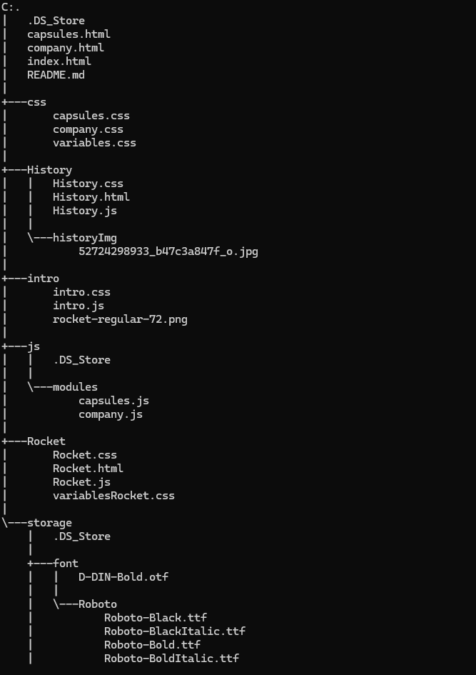
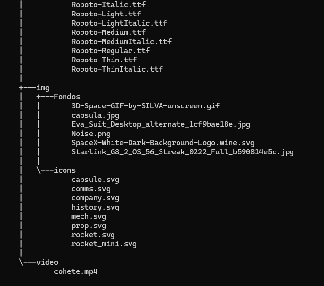

# SpaceX

Se realizó el aplicativo web para una empresa aeroespacial.

# Descripción

El presente aplicativo es un portafolio general, el cual permite visualizar todos los servicios realizados por los cohetes disponibles en esta empresa, desde la información técnica del producto hasta las posibles misiones a realizar.

Dicho portafolio cuenta con 4 secciones principales: 

* Rockets: Cuenta con información técnica, histórica y de costos sobre los diferentes cohetes que son propiedad de la empresa.

* Capsules: De forma breve y concisa muestra información de las capsulas usadas por la empresa.

* History: Incluye descripción, fecha e información detallada sobre los viajes realizados.

* Company: Esta sección fue hecha para conocer más a detalle la historia de la empresa.

# Tecnologías utilizadas

* HTML5
* CSS
* JavaScript

# Estructura del proyecto

Aquí podrás observar lo utilizado para llevar a cabo la creación de la página web de SpaceX. 

# Características

* Archivo `index.html`: Página de bienvenida.

* Archivos `.html`: Contiene la estructura de la página.

* Archivos ``.css``: Contiene las hojas de estilo para la presentación visual de la página.

* Archivos `.js`: Aporta la funcionalidad y estructura de la página.

* Carpeta `storage`: Contiene recursos como imágenes, videos y tipografías usadas en la página.

# Diseño

* El diseño de la página web de SpaceX sigue un enfoque moderno, y tecnológico que refleja el espíritu de innovación espacial de la empresa. Los colores predominantes son el negro con acentos en azul oscuro y gris metálico, evocando el cosmos y la tecnología aeroespacial.

* El diseño está optimizado para dispositivos móviles, tablets y PCs. Las imágenes se adaptan dinámicamente al tamaño de la pantalla para garantizar una experiencia óptima en cualquier dispositivo.

* Las imágenes de alta resolución de lanzamientos de cohetes, naves espaciales, y misiones están presentes en casi todas las secciones.

* Tipografía: La fuente principal es Roboto-Regular.

* La navegación es intuitiva, con menús simples y accesibles. La barra de navegación es fija en la parte inferior de la pantalla, permitiendo acceso rápido a las principales secciones.

Este diseño busca capturar la esencia pionera de SpaceX, ofreciendo una experiencia visualmente impresionante e informativa para los usuarios, mientras los sumerge en el mundo de la exploración espacial.

# Instrucciones

1. Clonar el repositorio cargado en GitHub.
~~~
https://github.com/wilmer7522/PROYECTO-FILTRO_JS_BUSTAMANTEJESUS-ROJASWILMER.git
~~~

2. Si trabajas desde VsCode, descarga la extensión `Live Server`.

3. Selecciona el archivo `index.html`, click derecho y selecciona `Open with Live Server`.

4. El archivo se cargará en tu navegador web.

# Desarrollado por:

El proyecto fue desarrollado por Jesús Leonardo Bustamante Ramírez y Wilmer Alexander Rojas Fuentes estudiantes de CampusLands como proyecto de filtro del módulo JavaScript.